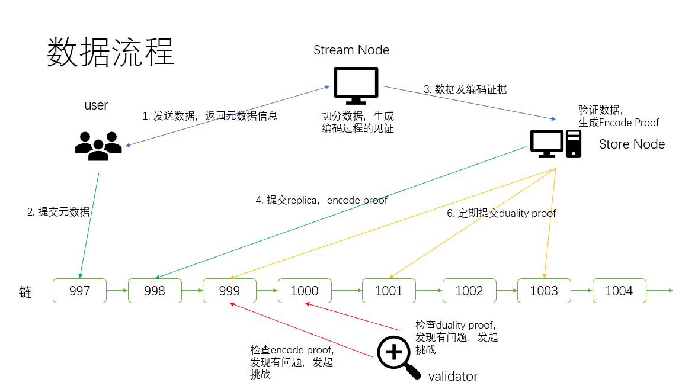

# dimo

## 架构

### 数据格式

+ piece：文件切分为多个piece，piece最大为992MB
+ replica：piece经过RS(n,k)编码后，得到n个replica，任意k个replica都可以修复出piece

### proof类型

+ EncodeProof：证明replica是piece经过RS(n,k)编码后的第某个数据块
+ DualityProof：证明节点上的数据是可用的

### 节点类型

+ stream：负责将文件切割，RS编码成为多个replica
+ store: 负责存储数据；提交EncodeProof到链上，表明数据是正确编码的一部分； 定期提交DualityProof到链上，证明数据的可用性
+ validator：验证提交的proof，在发现proof错误或不存在的时候，发起挑战

### 收益来源

+ stream：获取编码收益
+ store：获取存储收益；存储的补偿奖励
+ validator：成功质疑proof后，获取收益

